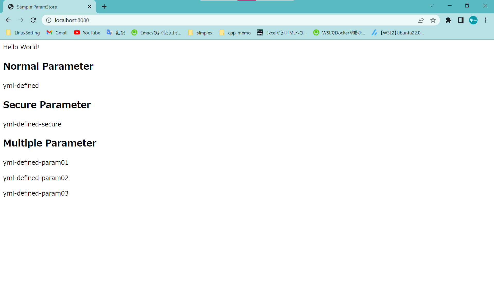
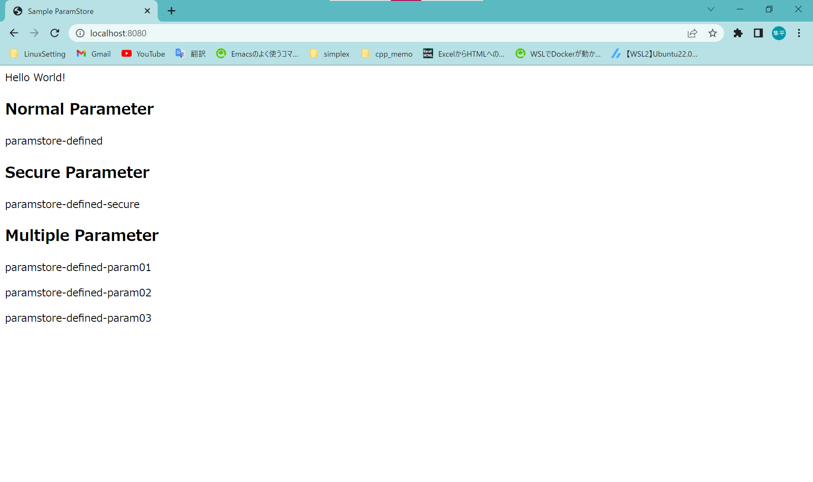
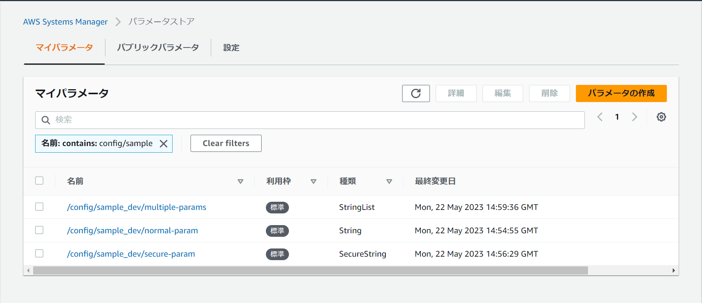
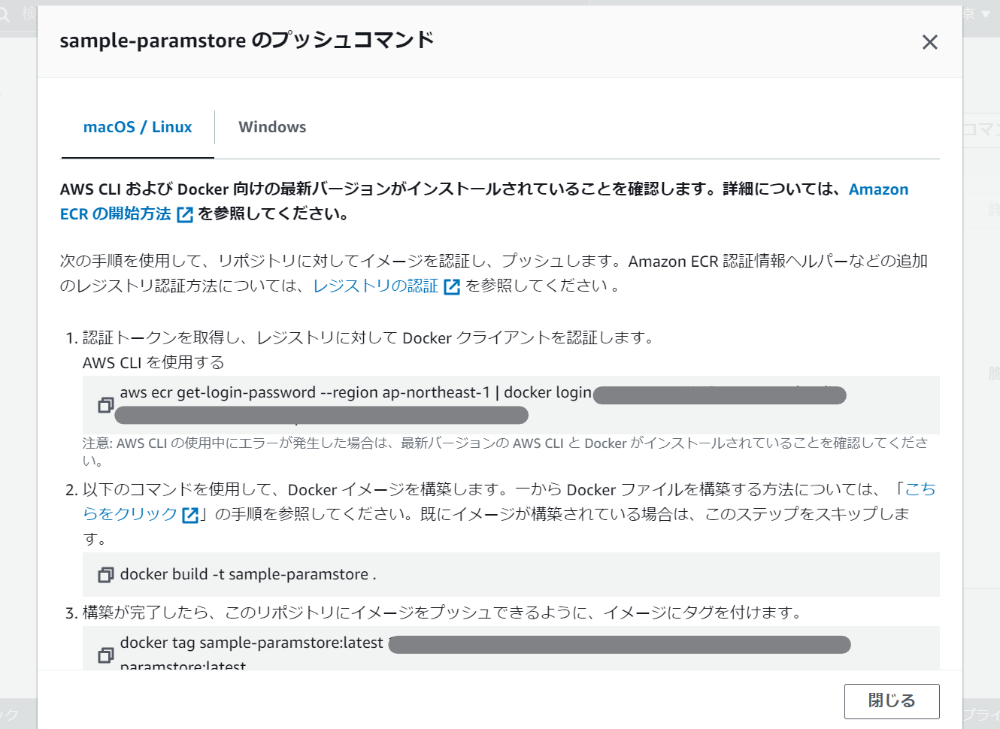
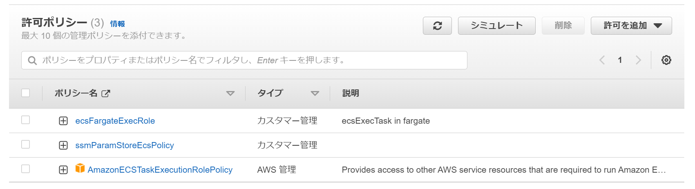
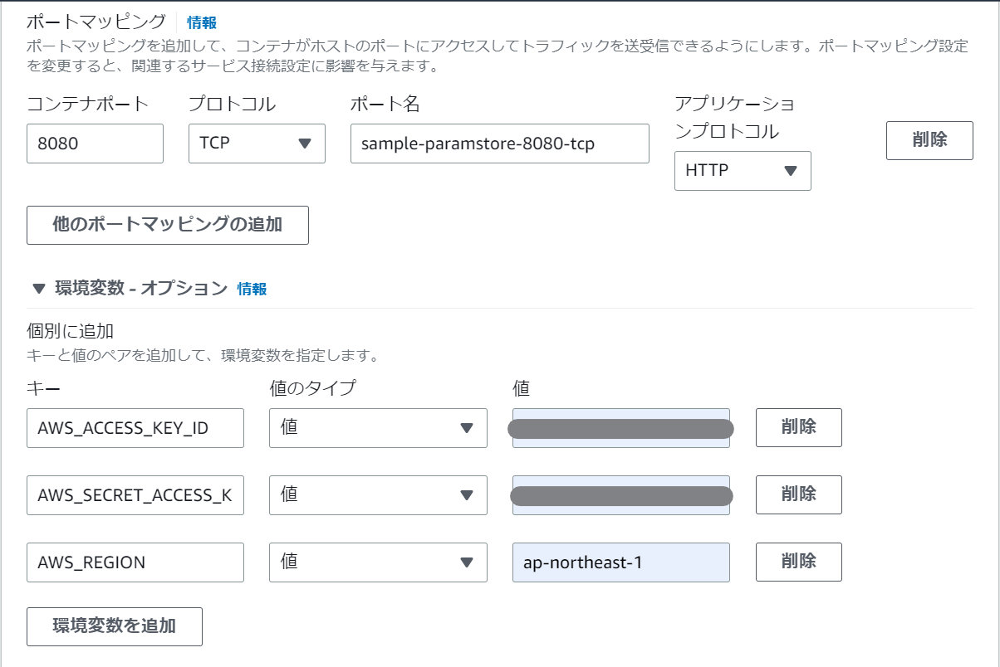
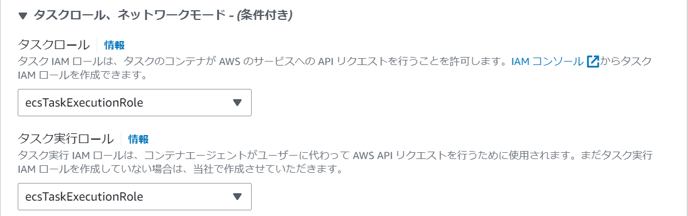
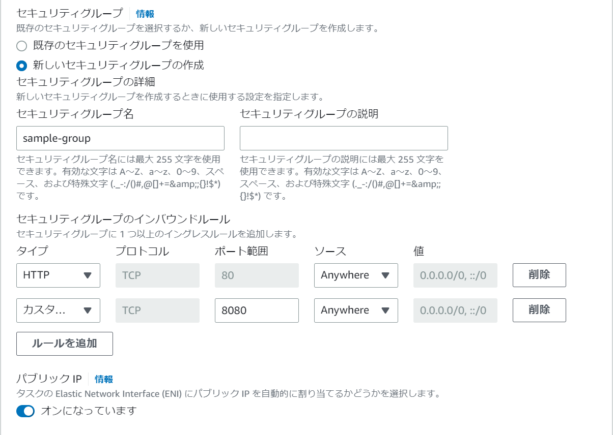
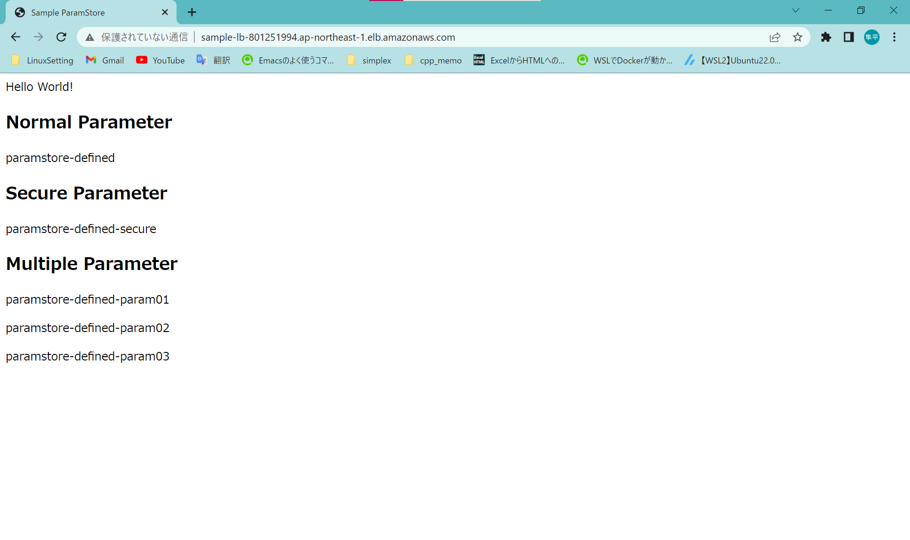

# Spring Boot × Parameter Store
## 本ドキュメントについて
本アプリケーションを使用してSpring Bootのapplication.ymlをAWSパラメータストアで書き換える設定例を提示する。また、ECSでアプリケーションを起動する手順の一例を記述する。

## アプリ機能
本アプリケーションは特にパラメータストアの設定をしない場合、以下のようにapplication.ymlファイルで設定した変数を表示する:<br>

このとき、application.ymlの設定は以下:
```yml
spring:
  application:
    name: sample
  profiles:
    active: dev
  config:
    import:

normal-param: 'yml-defined'
secure-param: 'yml-defined-secure'
multiple-params:
  - 'yml-defined-param01'
  - 'yml-defined-param02'
  - 'yml-defined-param03'
```

また、AWSパラメータストアを使用した場合、以下のような表示に切り替わる:<br>

このとき登録されているパラメータは以下の形式:



## Spring Bootアプリケーション設定
Spring側の設定例としては本アプリケーションのソースに記述されているが、特に必要な設定は以下である:<br>

build.gradle
```gradle
dependencies {
	implementation 'io.awspring.cloud:spring-cloud-starter-aws-parameter-store-config:${version}'
}
```
application.yml
```yml
spring:
  config:
    import:
      - 'aws-parameterstore:'
```
※ ローカルで起動する場合は以下の環境変数を適切に設定する必要がある:<br>
```
AWS_ACCESS_KEY_ID
AWS_SECRET_ACCESS_KEY
AWS_REGION
```

## ECS起動手順例
### ECRへの登録
ECRにてレポジトリを作成し、本アプリケーションのDockerfileおよびECRで提示されたコマンドにてimageを作成する.<br>


### タスク用のIAMロールの作成
タスク用のIAMロールには以下のポリシーをアタッチする:<br>

ここでカスタムポリシーはそれぞれ以下のjsonで定義

ecsFargateExecRole
```json
{
    "Version": "2012-10-17",
    "Statement": [
        {
            "Effect": "Allow",
            "Action": [
                "ssmmessages:CreateControlChannel",
                "ssmmessages:CreateDataChannel",
                "ssmmessages:OpenControlChannel",
                "ssmmessages:OpenDataChannel"
            ],
            "Resource": "*"
        }
    ]
}
```

ssmParamStoreEcsPolicy
```json
{
    "Version": "2012-10-17",
    "Statement": [
        {
            "Effect": "Allow",
            "Action": [
                "ssm:GetParameters",
                "secretsmanager:GetSecretValue",
                "kms:Decrypt"
            ],
            "Resource": "*"
        }
    ]
}
```
※ 必要最小限のポリシーについては追加で検証必要. 上記はあくまで"十分条件".

### ECSクラスターの作成
ECS画面でクラスターの作成ボタンを押下し、適当な名前を入力して作成を行う.<br>
※ 今回ネットワーキングはデフォルトのVPCを使用

### ECSタスク定義
ECSタスク定義を実施する. 以下の点に注意
- コンテナイメージのURLにはECRで作成したレポジトリのURLを入力する.
- 以下のようにポート番号および環境変数を設定する

※ 環境変数の設定はIAMポリシーで解決できる可能性あり.
- タスクロールおよびタスク実行ロールにIAMロールで作成したecsTaskExecutionRoleを設定


### ECSサービスの作成
ECSサービスを作成する. 基本的にデフォルトで設定したが以下の点に注意
- タスクには上で定義したものを指定. また、必要タスクは今回は2とする.
- セキュリティグループは新しいものを定義. インバウンドルールには80と8080ポートを追加

- ロードバランサはALBを使用

### 画面確認
ECSサービス起動後にロードバランサのURLにアクセスして起動確認を行う<br>

※ パラメータストアの値が反映されているのがわかる
